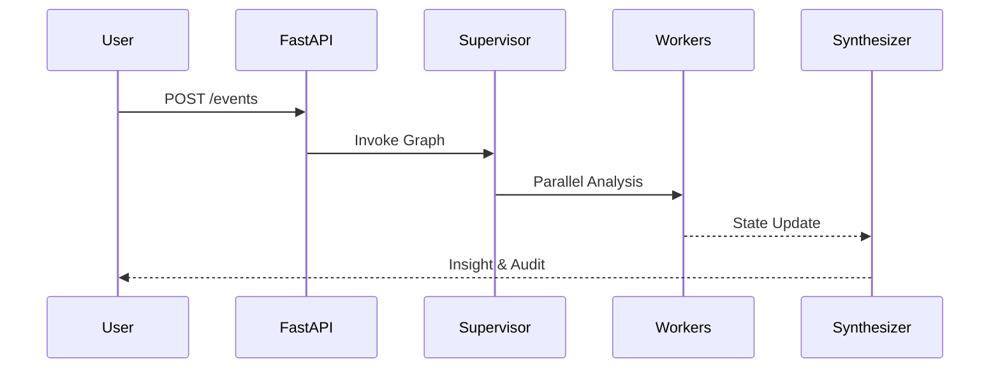

# ADR 001: Implementing the Supervisor Pattern with LangGraph

## Status
Proposed

## Context
Orbitr needs to analyze multiple aspects of an engineering event (Compliance, Anomaly, Resources) simultaneously. A linear pipeline would be slow and brittle.

## Decision
We will use the **Supervisor Pattern** implemented via `LangGraph`. 

- The `Supervisor Agent` will act as a router that determines which analysis agents need to run based on the event type (e.g., `Deployment` vs `Runtime`).
- Functional analysis agents (`Compliance`, `Anomaly`, `ResourceWatcher`) will run in **parallel** (StateGraph nodes).
- All results will be aggregated into a single `WorkflowState` for the `Insight Synthesizer`.

## Consequences

### Positive
- **Scalability**: New analysis agents can be added with minimal changes to the orchestrator.
- **Speed**: Agents run in parallel.
- **State Tracking**: LangGraph's checkpointer allows for long-running workflows and debugging.

### Negative
- **Complexity**: Requires careful management of the `TypedDict` state to avoid race conditions (LangGraph handles this by default).
- **LLM Cost**: The Supervisor adds an extra LLM call if dynamic routing is used (though for the MVP, logic-based routing is preferred).

## Visual Sequence

