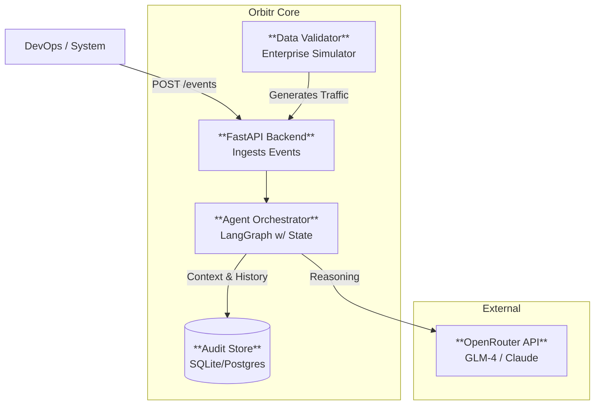

# Orbitr System Design (Functional MVP)

## 1. Context (Level 1)
Orbitr is an **Intelligent Observability & Compliance Platform**.
**Scope**: Ingestion, intelligent analysis (Agents), and persistent auditing.
**Out of Scope**: User Authentication, Frontend UI (Future Phase).

## 2. Core Components

### A. The Backend (`src/main.py`)
- **FastAPI**: Specialized for high-concurrency async event ingestion.
- **Endpoints**:
    - `POST /events`: Main entry point.
    - `GET /health`: System status.

### B. The Brain (`src/graph/`)
- **LangGraph**: Manages the lifecycle of an event.
- **Persistence**: Every step (Agent -> Agent) is checkpointed to `DB`. This allows "Time Travel debugging" (rewinding an event processing flow).

### C. The Agents (`src/agents/`)
- **Design**: "Thick" agents. Not just prompts, but Python logic + LLM reasoning.
- **LLM Strategy**: Use **OpenRouter (GLM-4/Claude)** for cost-effective, high-intelligence reasoning.

### D. The Database
- **Technology**: SQLite (for portable, single-file production reliability) or Postgres.
- **Schema**: Stores `StandardizedEvent`, `WorkflowState`, and `AuditLogs`.

## 3. Deployment Strategy
- **Container**: Dockerfile provided for the Backend.
- **No Auth**: deploying behind a private VPC or internal network assumption for this phase.
