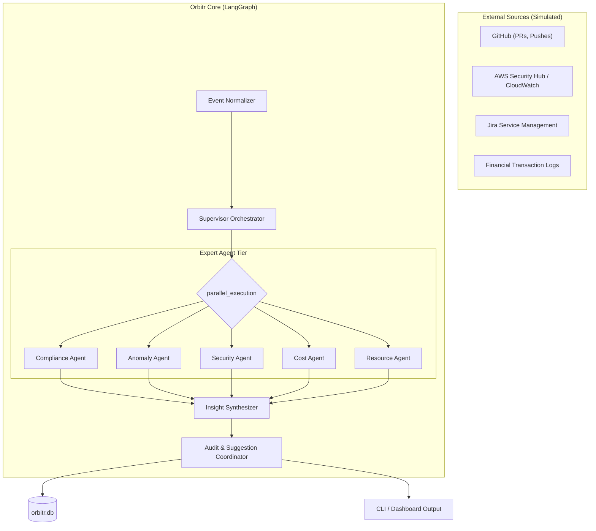

# Blueprint: IT Org Observability

Orbitr is designed for **scaling IT organizations** that require rigorous monitoring across infrastructure, security, and finance.

## 🏛️ System Architecture

## 📊 Monitoring Domains

| Domain | Focus Area | Industry Standard |
| :--- | :--- | :--- |
| **Integrity** | Financial reconciliation mismatches | SOC 2 (Processing Integrity) |
| **Trust** | MFA bypass and privilege escalation | ISO 27001 (A.9 Access Control) |
| **Safety** | PII leakage and secret detection | GDPR / SOC 2 (Confidentiality) |
| **Efficiency** | Cloud auto-scaling & cost spikes | FinOps Best Practices |
| **Stability** | Mean Time to Detection (MTTD) | SRE Principles |

## 🔄 State-Machine Logic
Orbitr uses a **Transactional State Machine**. Every event processed is a "Transaction" that either:
1.  **Succeeds**: Updates the audit log with "Clear" status.
2.  **Flags**: Updates the audit log with one or more security/compliance flags + RCA.
