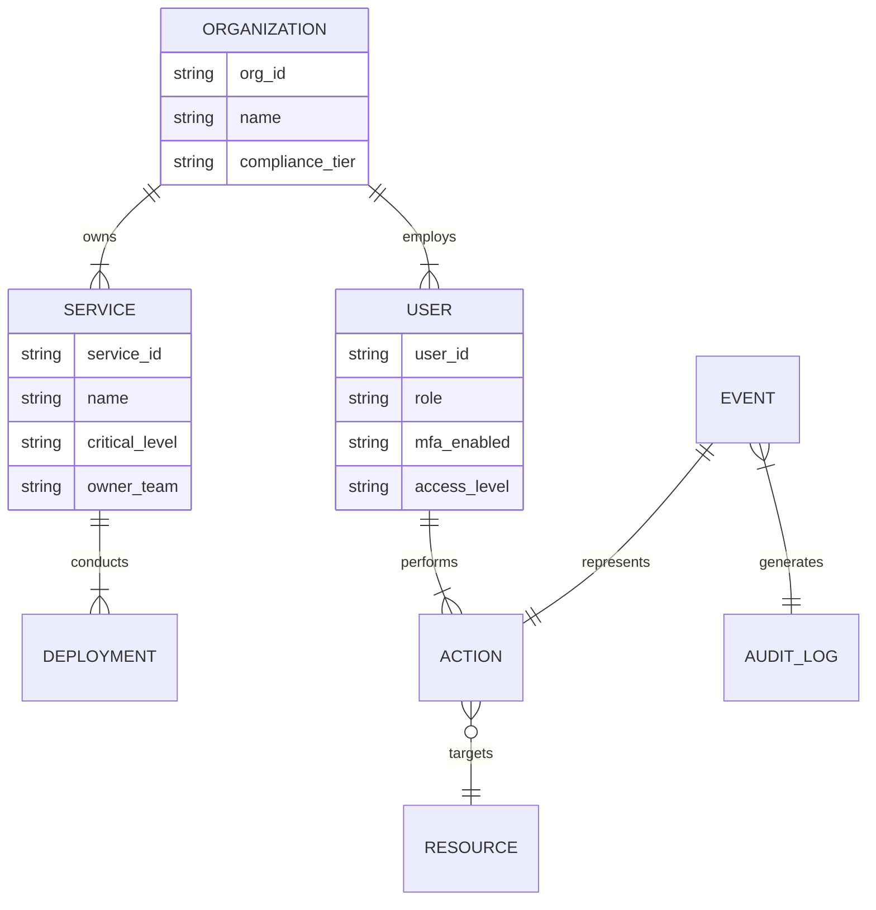

# Data Models & Schemas

To ensure production-grade reliability, Orbitr enforces strict typing and referential integrity across all simulated and processed data.

## 1. Entity Relationship Diagram (ERD)



## 2. Event Schema (The "Golden Source")
All incoming data is normalized into this structure before agent processing.

```python
class StandardizedEvent(BaseModel):
    event_id: str          # UUIDv4
    correlation_id: str    # Trace ID for the entire workflow
    timestamp: float       # UTC Timestamp
    
    # Classification
    event_type: str        # e.g., "Deployment", "Login", "Transaction"
    domain: str            # e.g., "Security", "Finance", "DevOps"
    source_system: str     # e.g., "GitHub", "AWS-CloudTrail"
    severity: str          # "Low", "Medium", "High", "Critical"
    
    # Context (The "Why" and "Who")
    actor_id: str          # User or Service Account ID
    resource_id: str       # Target Resource ID (e.g., db-prod-01)
    
    # Raw Data
    payload: Dict[str, Any] # The original JSON payload
```

## 3. Workflow State (The "Brain" Memory)
The typed dictionary passed between LangGraph nodes.

```python
class WorkflowState(TypedDict):
    # Inputs
    event: StandardizedEvent
    
    # Parallel Agent Outputs (All lists to allow multiple findings)
    compliance_flags: List[ComplianceFinding]
    security_flags: List[SecurityFinding]
    anomaly_flags: List[AnomalyFinding]
    cost_flags: List[CostFinding]
    resource_flags: List[ResourceFinding]
    
    # Synthesis
    rca_summary: str        # The LLM-generated Root Cause Analysis
    remediation_plan: Dict  # Structured CLI commands for fixes
    
    # Meta
    execution_trace: List[str] # Debug log of which agents ran
```

## 4. Audit Log Schema (Persistence)
What gets written to `orbitr.db` for legal/compliance review.

```sql
CREATE TABLE audit_logs (
    id TEXT PRIMARY KEY,
    correlation_id TEXT NOT NULL,
    timestamp DATETIME DEFAULT CURRENT_TIMESTAMP,
    
    event_type TEXT,
    severity TEXT,
    actor_id TEXT,
    
    -- Analysis Results (stored as JSONB in Postgres / TEXT in SQLite)
    findings_json TEXT,
    rca_text TEXT,
    remediation_json TEXT,
    
    -- Status
    status TEXT -- "Resolved", "Open", "Flagged"
);
```
